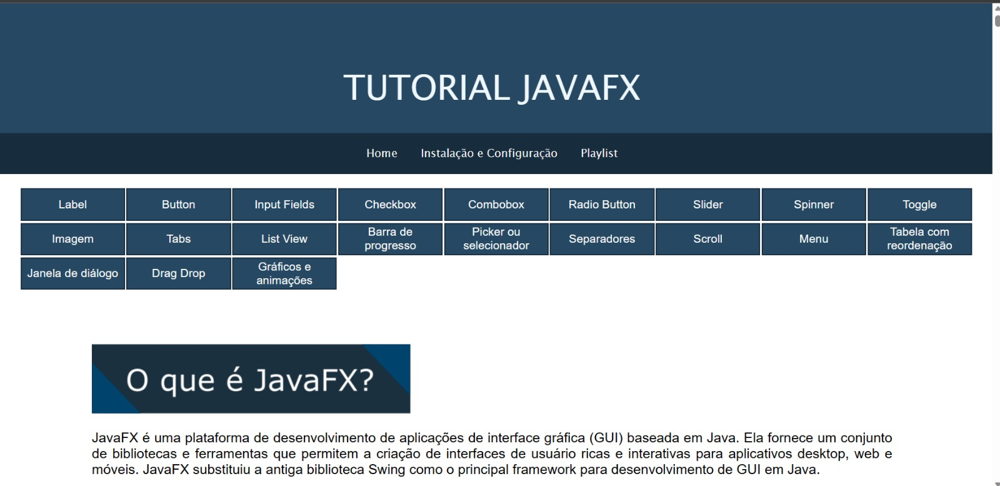
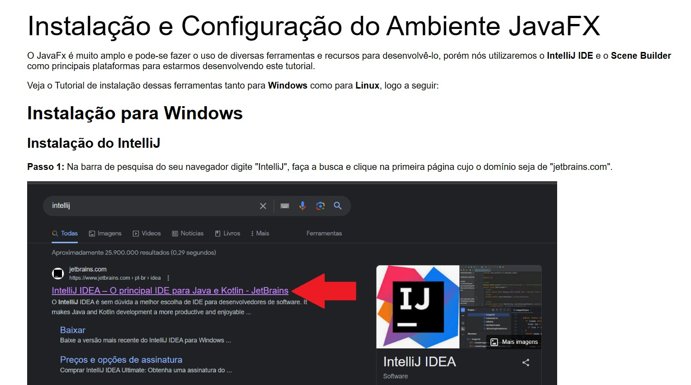
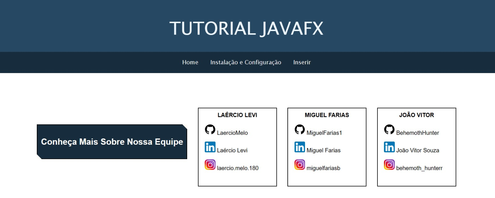
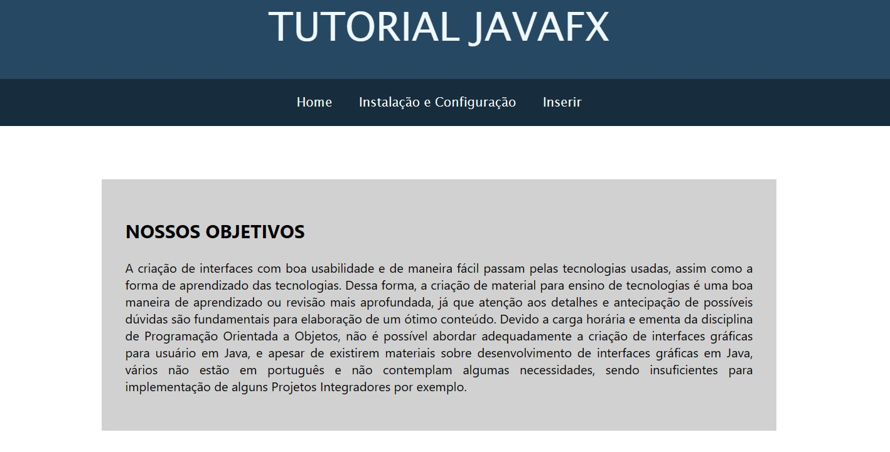
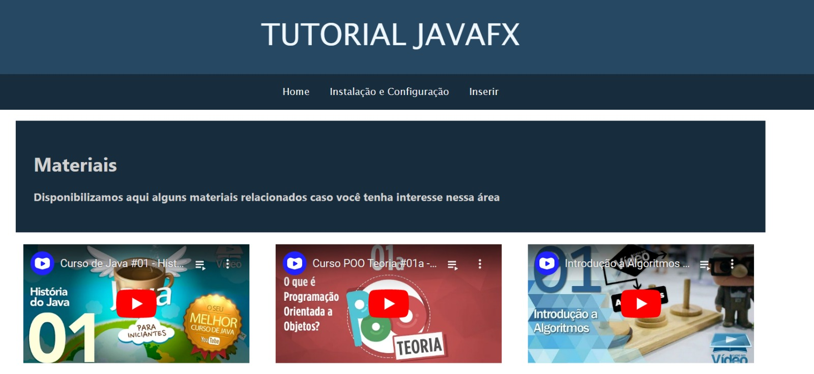

# PROJETO TUTORIAL USANDO JAVAFX

- Para começar a desenvolver em Java, você precisará do JDK (Java Development Kit). Você pode baixar a versão mais recente do JDK no site oficial da Oracle:
[Download do JDK](https://www.oracle.com/java/technologies/javase-jdk11-downloads.html)

- Além disso, uma ótima opção de IDE para desenvolvimento Java é o IntelliJ IDEA. Ele fornece um ambiente de desenvolvimento completo com recursos avançados. Você pode fazer o download do IntelliJ IDEA no site oficial da JetBrains:
[Download do IntelliJ IDEA](https://www.jetbrains.com/idea/download/)

- Se você preferir uma alternativa ao IntelliJ IDEA, outra opção popular para desenvolvimento Java é o Visual Studio Code (VSCode). Ele é uma IDE leve e altamente personalizável. Você pode baixar o VSCode em seu site oficial:
[Download do Visual Studio Code](https://code.visualstudio.com/download)

- O JavaFX é uma plataforma para construção de aplicativos de desktop com interface gráfica em Java. Você pode obter mais informações e baixar o JavaFX no site oficial:
[Download do JavaFX](https://openjfx.io/)

- O Scene Builder é uma ferramenta gráfica para criar interfaces de usuário JavaFX. Ele oferece uma interface intuitiva para projetar e construir layouts de aplicativos JavaFX. Você pode fazer o download do Scene Builder no site oficial:
[Download do Scene Builder](https://gluonhq.com/products/scene-builder/)

- [Link para o tutorial de configuração LINUX](https://youtu.be/L0RIONQ07_8)

# Imagens do site do projeto

- Página inicial 

- Instalação e configuração do ambiente

- Referências para os autores

- Objetivos

- Página inicial dos vídeos

# Tópicos

- Label ✅
- Input Field ✅
- Button ✅
- ComboBox ✅
- ListView ✅
- Picker ✅
- Barra de progresso ✅
- RadioButton ✅
- Separadores ✅
- Slider ✅
- DragAndDrop ✅
- TabPanelImage ✅
- Scroll ✅
- TabPanes ✅
- Images ✅

- [Link para a PlayList](https://youtube.com/playlist?list=PLYLBC6nOu9HJ_F_YrYwm4JWliXdZyJFLF)